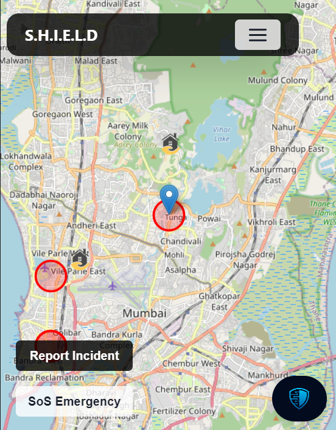
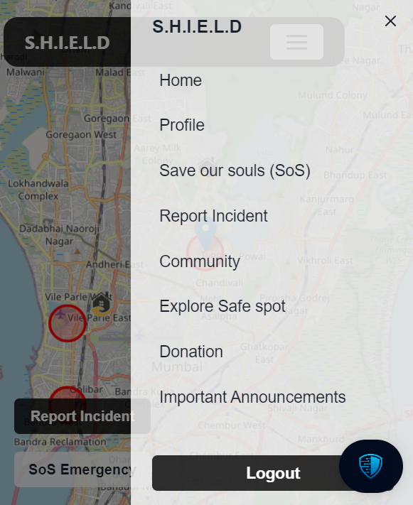
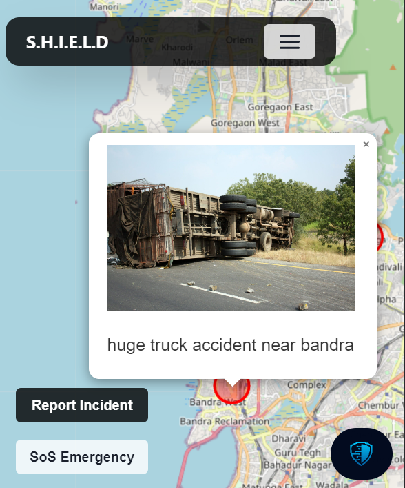
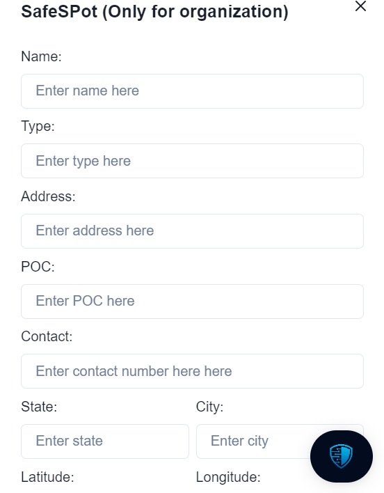
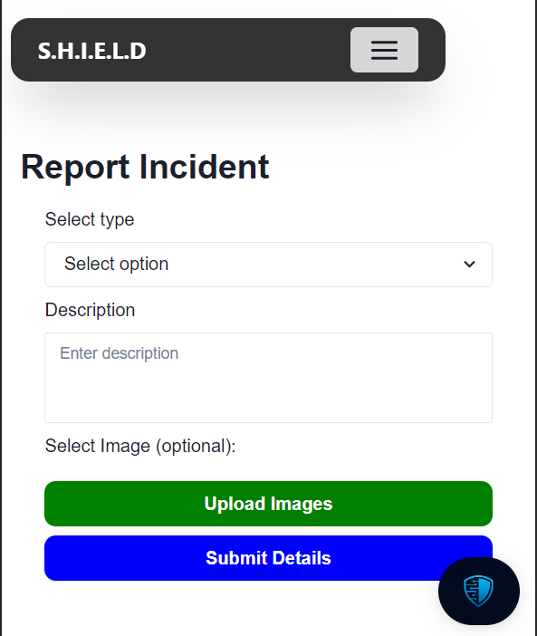
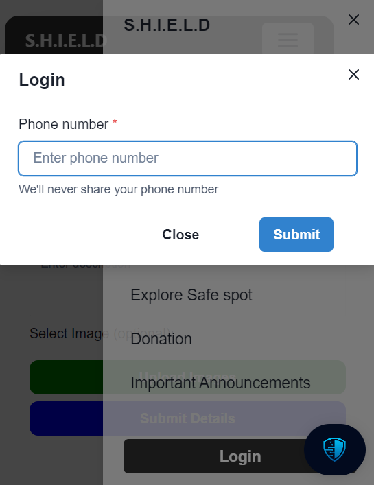
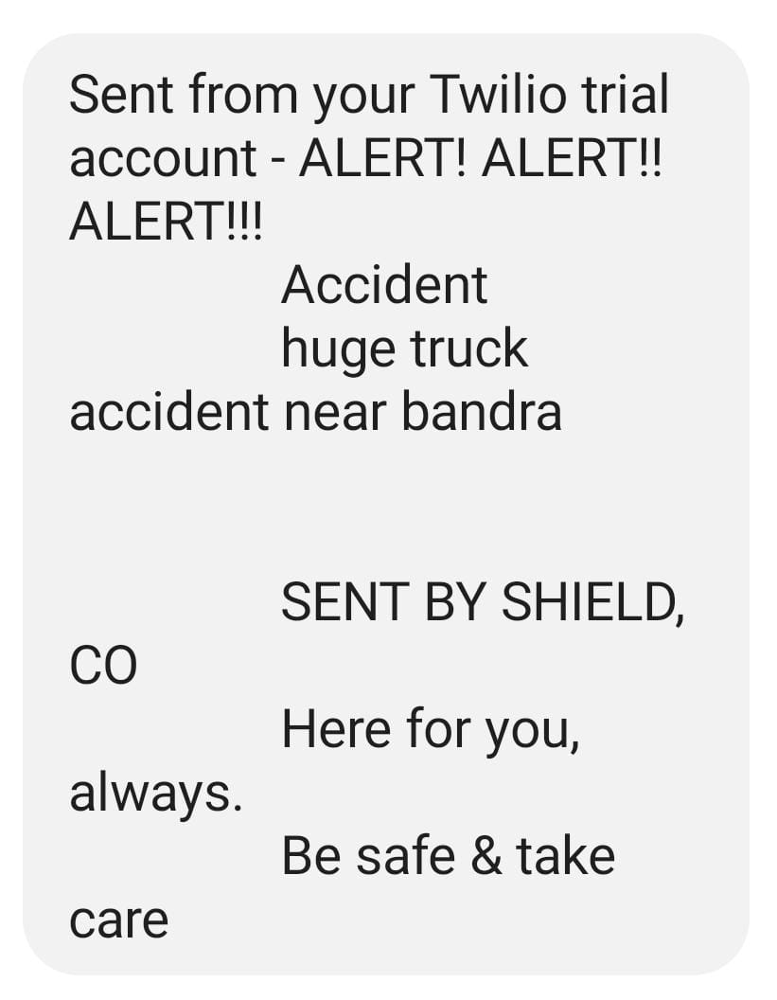
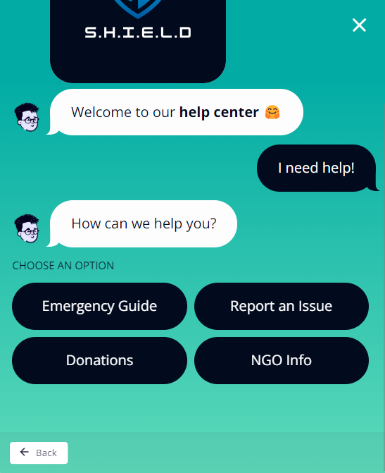
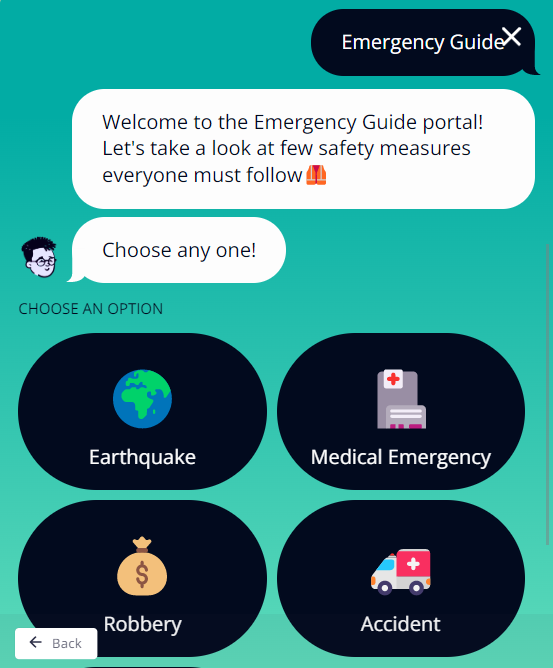
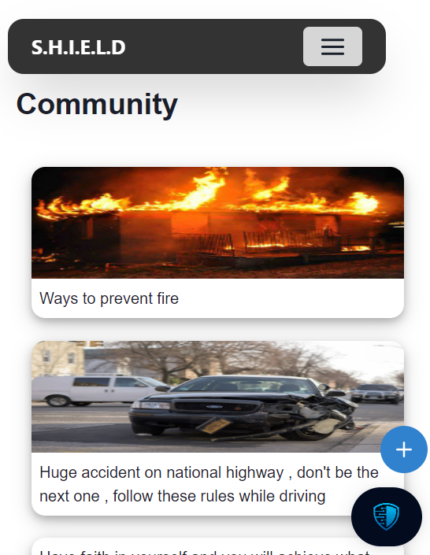

# S.H.I.E.L.D: To make you Beware of your surrounding
The main aim of the S.H.I.E.L.D is to safeguard the individual and also make them aware about the abnormal or critical situation in the surrounding. So, that they should take the course of action according to that. An emergency guide to help you to reach out for help and safeguard 🏡


S.H.I.E.L.D provides a community which helps other by sharing/reporting the uncertain behaviour or sitatuion. Reporting done by any individual seems to be as an announcement to all the people nearby 📣 (around 2 km radius)


## Features

 📝 To register uncertain condition on website

 🔔 Notifying the uncertain condition/incident to the indivudals living in the locality

 ⚠️ Real Time Disaster Notification & update will be reported as an alert to the user and also visible on the Map

 🌀 To Showcase the Safe Spots/NGO (Organization Associated) at the time of Natural Disaster

 📢 Reported incident would be visible on the geomap
 
 🧭 Helps to Navigate to the nearest Safe Spots/NGO through Map

 💰 Donation can be done for the associated NGO/Organization

 🏆 S.H.I.E.L.D Coins as rewards for an individual who reports the incident 
## Languages and Tools

<p align="left"> <a href="https://www.gnu.org/software/bash/" target="_blank" rel="noreferrer">  </a> <a href="https://www.w3schools.com/css/" target="_blank" rel="noreferrer">  </a> <a href="https://git-scm.com/" target="_blank" rel="noreferrer">  </a> <a href="https://www.w3.org/html/" target="_blank" rel="noreferrer">  </a> <a href="https://developer.mozilla.org/en-US/docs/Web/JavaScript" target="_blank" rel="noreferrer">  </a> <a href="https://www.linux.org/" target="_blank" rel="noreferrer">  </a> <a href="https://nextjs.org/" target="_blank" rel="noreferrer">  </a>  <a href="https://tailwindcss.com/" target="_blank" rel="noreferrer">   <a href="https://leafletjs.com/" target="_blank" rel="noreferrer"> </a> <a href="https://landbot.io/" target="_blank" rel="noreferrer"> </a> <a href="https://www.twilio.com/.com/" target="_blank" rel="noreferrer"> </a>  <a href="https://nodejs.org/en/.com/.com/" target="_blank" rel="noreferrer"> </a>  
 </p>


## Documentation

### 🏗️ Our Project

The main motive of S.H.I.E.L.D is to make an environment which helps the user and also make it aware about the situations and also about how to deal with that.

## Snapshots


| Home Page  | Our Features | Live Incident Tracker |
|------------|--------------|-----------------------|
|  |  |  | 

| NGOs Mapping | NGOs Info | Register Incident |  
|--------------|-----------|-------------------|
|  |  |  |

| Login  | Live Notifications | Donations |  
|--------|--------------------|-----------|
|  |  |  |
 
| Chatbot  | It's Features | Community Page  |  
|----------|---------------|-----------------|
|  |  |  |


## Instructions on running project locally:

Clone the project

```bash
  git clone https://github.com/prathikshetty2002/Codeissance_41_Devshaks.git
```

Install dependencies:

```bash
  cd www.shield.com/
  
  yarn install
```

Run Project on terminal

```bash
  yarn dev
```

Start the server

```bash
  http://localhost:3000
```
    
Things to add on:
1. To add slicer and filters. So, that naviagtion to the targeted incident would be easy.
2. To add different color for different category.
3. To improve UI.


## Authors

🔆 [@Mr-Jayesh](https://github.com/Mr-Jayesh)

🔆 [@R-ctrl-ctrl](https://github.com/R-ctrl-ctrl)

🔆 [@hrishikesh332](https://www.github.com/hrishikesh332)

🔆 [@prathikshetty2002](https://github.com/prathikshetty2002)


